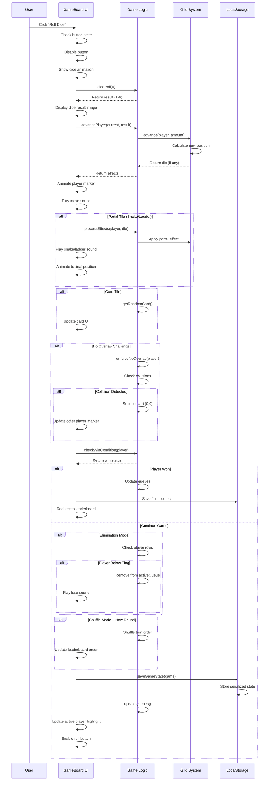

# Snake & Ladders Web Project - Emergency Interview Prep
## Part 1: Game Loop Visualization (Mermaid Diagrams)

---

# TASK 1: THE LOGIC VISUALIZATION
## Complete Game Loop Mermaid Flowchart

```mermaid
flowchart TB
    subgraph USER_INTERACTION["🎮 USER INTERACTION LAYER"]
        A[User Clicks<br/>'Roll Dice' Button] --> B{Button State<br/>Check}
        B -->|Active| C[Trigger Dice Roll]
        B -->|End Turn| D[Switch Player Turn]
        KSPACE[Space/Enter Key] --> B
    end

    subgraph DICE_ROLL["🎲 DICE ROLL PHASE"]
        C --> E[Show Dice Animation GIF]
        E --> F[Generate Random 1-6<br/>diceRoll(ROLL_SIZE)]
        F --> G[Play Dice Sound Effect]
        G --> H[Display Dice Result Image]
    end

    subgraph MOVEMENT["🏃 PLAYER MOVEMENT PHASE"]
        H --> I[Calculate New Position<br/>grid.advance(player, result)]
        I --> J[Play Move Sound]
        J --> K[Animate Player Marker<br/>CSS Transform]
        K --> L[Update Square Number UI]
    end

    subgraph TILE_EFFECTS["🎯 TILE EFFECTS CHECK"]
        L --> M{Tile at Position?}
        M -->|PortalTile<br/>(Snake/Ladder)| N[Apply Portal Effect]
        M -->|CardTile| O[Give Random Card]
        M -->|Normal Tile| P[Continue]
        N --> Q[Play Snake/Ladder Sound]
        O --> R[Update Card UI]
        Q --> S[Animate to New Position]
    end

    subgraph CHALLENGES["⚡ CHALLENGE MODES"]
        S --> T{No Overlap Mode?}
        T -->|Yes| U[Check Collision]
        U --> V{Players Same Position?}
        V -->|Yes| W[Send to Start<br/>enforceNoOverlap]
        V -->|No| X[Continue]
        T -->|No| X
        W --> X
        
        X --> Y{Shuffle Mode?}
        Y -->|Yes| Z[Check Round End<br/>activeQueue.id < last_index]
        Z -->|New Round| AA[Shuffle Turn Order<br/>Fisher-Yates Sort]
        Z -->|Same Round| AB[Continue]
        Y -->|No| AB
        AA --> AB
    end

    subgraph ELIMINATION["💀 ELIMINATION MODE"]
        AB --> AC{Elimination Mode?}
        AC -->|Yes| AD[Check Player Rows]
        AD --> AE{Player Below<br/>Flag Row?}
        AE -->|Yes| AF[Remove from<br/>activeQueue]
        AF --> AG[Play Lose Sound]
        AE -->|No| AH[Continue]
        AC -->|No| AH
        AG --> AH
    end

    subgraph WIN_CHECK["🏆 WIN CONDITION CHECK"]
        AH --> AI[Check Win Condition<br/>position === goal]
        AI --> AJ{Player at Square 100?}
        AJ -->|Yes| AK[Add to winQueue]
        AK --> AL{Game Over?}
        AL -->|Single Winner| AM[Redirect to<br/>Leaderboard]
        AL -->|Multiple Players| AN[Remove from<br/>activeQueue]
        AJ -->|No| AO[Continue Turn]
        AN --> AO
    end

    subgraph STATE_MANAGEMENT["💾 STATE PERSISTENCE"]
        AO --> AP[Save Game State<br/>saveGameState()]
        AP --> AQ[Serialize to JSON<br/>game.toJson()]
        AQ --> AR[Store in LocalStorage<br/>localStorage.setItem]
        AR --> AS[Update UI Highlights]
    end

    subgraph TURN_SWITCH["🔄 TURN MANAGEMENT"]
        AS --> AT[Switch to Next Player<br/>activeQueue.next()]
        AT --> AU[Update Turn Display]
        AU --> AV[Enable Roll Button]
        AV --> A
        D --> AT
    end

    AM --> AW[Calculate Final Scores]
    AW --> AX[Store in LocalStorage]
    AX --> AY[Display Rankings]

    %% Styling
    style A fill:#4CAF50,stroke:#2E7D32,stroke-width:3px,color:#fff
    style AM fill:#FFD700,stroke:#FFA000,stroke-width:3px,color:#000
    style AK fill:#FF6B6B,stroke:#C92A2A,stroke-width:2px,color:#fff
    style AP fill:#339AF0,stroke:#1864AB,stroke-width:2px,color:#fff
    style AF fill:#FF8787,stroke:#C92A2A,stroke-width:2px,color:#fff
```

---

## Alternative: Detailed Sequence Diagram



---

## Key Code References for Whiteboard Explanation

| Phase | Key Code Location | Method/Function |
|-------|-------------------|-----------------|
| Dice Roll | `game-board.js:665` | `diceRoll(ROLL_SIZE)` |
| Player Movement | `grid.js:32` | `advance(player, amount)` |
| Portal Effect | `portalTile.js:34` | `effect(game, player)` |
| Card Effect | `cardTile.js:31` | `effect(game, player)` |
| No Overlap | `game.js:131` | `enforceNoOverlap(player)` |
| Shuffle | `game.js:183` | `sort(() => Math.random() - 0.5)` |
| Elimination | `game-board.js:608` | Check `position.y < currentEliminationRow` |
| Win Check | `game.js:221` | `checkWinCondition(player)` |
| Save State | `saving-and-loading.js:7` | `saveGameState(game)` |
| Turn Switch | `game.js:162` | `updateQueues()` |

---

## Quick Interview Pitch (30 seconds)

> "My Snake & Ladders game follows a clean event-driven architecture. When the user clicks 'Roll Dice', we trigger a dice animation, calculate the result, and advance the player using grid coordinates. We then check for special tiles - PortalTiles for snakes/ladders, CardTiles for power-ups. Challenge modes add complexity: No Overlap sends colliding players back to start, Shuffle randomizes turn order each round, and Elimination removes players falling behind a rising flag. After each turn, we save the complete game state to LocalStorage as JSON, enabling session persistence. The UI stays synchronized through a one-way data flow from the Game class to DOM updates."
